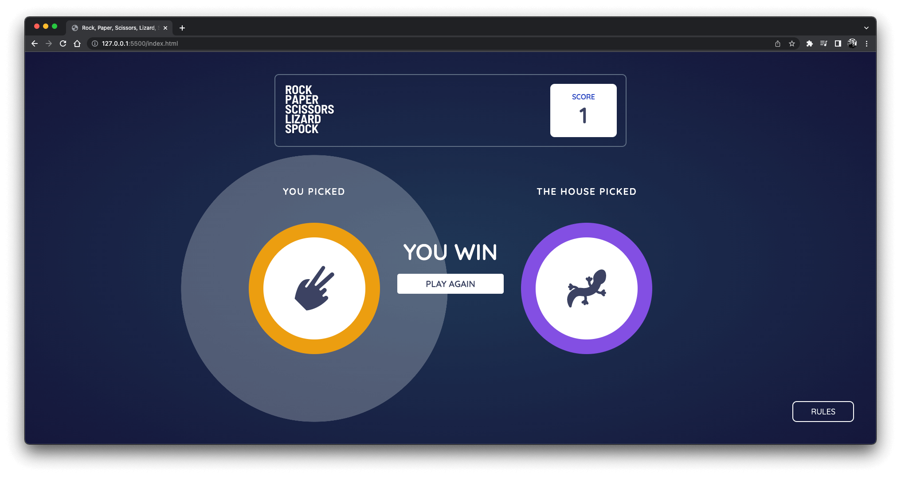

# Rock, Paper, Scissors, Lizard, Spock

## Table of contents

- [Overview](#overview)
- [Rules](#rules)
- [Screenshot](#screenshot)
- [Links](#links)
- [Built with](#Built-with)

## Overview

- Rock, Paper, Scissors, Lizard, Spock game created with HTML, CSS and Javascript.
- Rock Paper Scissors Lizard Spock is an extension of the classic game of chance, Rock Paper Scissors, created by Sam Kass and Karen Bryla. Because it seemed like most games of Rock Paper Scissors with people you know would end in a tie.
- It is first used to settle a dispute about what to watch on TV between Sheldon and Raj on The Big Bang Theory show 😀.
- You can choose from Rock, Paper, Scissors, Lizard and Spock. After you have taken your move, computer will take the next move and based on the game rules given below, result will be presented.
- You will earn +1 point if you win and -1 if you lose. Score will also be saved in the local storage, so you won't lose your progress.

## Rules

## Screenshot

## Links

- Live Site URL: 

## Built with

- HTML
- CSS
- Javascript
